<div align="center">


### Adversarial stress-testing methodology for AI agents

*Your project, having the worst day ever — before your users give it one.*

[](LICENSE)
[](#the-8-dimensions)
[](#safeguards)

</div>

---

## What It Does

| Step | Action |
|:---:|---|
| **1. MAP** | Discovers your project's interface — routes, types, state machines, logs |
| **2. GENERATE** | Creates pathological scenarios across 8 attack dimensions |
| **3. SANDBOX** | Runs everything isolated — no real data, no secrets, no shared state |
| **4. EXECUTE** | Fires scenarios one at a time, captures results |
| **5. REPORT** | Produces a severity-ranked disaster report with remediation |



```
  ┌──────────┐    ┌──────────────┐    ┌───────────┐    ┌──────────┐    ┌─────────┐
  │   MAP    │───▶│   GENERATE   │───▶│  SANDBOX  │───▶│ EXECUTE  │───▶│ REPORT  │
  └──────────┘    └──────────────┘    └───────────┘    └──────────┘    └─────────┘
     discover         produce 28-40        isolate          fire one       severity +
     surface          pathological        container        at a time      remediation
                      scenarios
```

---

## The 8 Dimensions

```
     ▲ SEVERITY
     │
  10 │                          ╭─╮
     │    ╭─╮                   │6│
   8 │    │1│    ╭─╮            ╰─╯         ╭─╮
     │    ╰─╯    │3│         ╭─╮            │7│
   6 │           ╰─╯         │5│            ╰─╯              ╭─╮
     │  ╭─╯                  ╰─╯         ╭─╮               │8│
   4 │  │2│    ╭─╮                       │4│               ╰─╯
     │  ╰─╯    │ │                       ╰─╯
   2 │         ╰─╯
     │
   0 ┼──────────────────────────────────────────────────────────────▶
       Input    State    Temporal   AuthNZ   Data    Concurrent External Brownfield
       Boundary Machine  /Timing            Integrity          Deps      Mining
```

| # | Dimension | What it attacks |
|:---:|---|---|
| 1 | **Input Boundary** | Max-length strings, null bytes, Unicode RTL overrides, type confusion, deep nesting, NaN/Infinity |
| 2 | **State Machine Torture** | Double-submit, back-button resurrection, out-of-order transitions, concurrent mutations |
| 3 | **Temporal / Timing** | Expired tokens, clock skew, counter races, connection pool depletion |
| 4 | **AuthN/Z Shadow** | Horizontal/vertical escalation, scope mismatch, cross-tenant access |
| 5 | **Data Integrity Cascade** | Delete referenced entities, encoding roundtrips, pagination edges, constraint bypass |
| 6 | **Concurrent Load** | Thundering herd, cache death spiral, write skew, lock escalation |
| 7 | **External Dependency Failure** | Payment gateway down, email timeout, DNS failure, malformed third-party responses |
| 8 | **Brownfield Mining** | Parse production logs for worst errors, replay with variations |

---

## Tagline

> Sometimes you're just having the worst day ever. Just when you think, "how could it get any worse?" it does. A sandboxed adversarial simulation that pushes your project to its limit before someone clicks your buttons more than 10,000 times.

---

## Safeguards

```
 ┌─────────────────────────────────────────────────────────────────────────┐
 │                                                                         │
 │  🛡️  NO real data        — synthesized inputs only                      │
 │  🔒  NO secrets           — test tokens, never read .env                │
 │  📦  SANDBOXED execution  — isolated subprocess / DB fake / HTTP stub   │
 │  🚫  NO external calls    — all upstreams stubbed with failure modes    │
 │  ⏱️  BOUNDED duration     — 30s per flow, hung = killed + reported      │
 │  🔄  NO mutation          — writes captured, rolled back, or throwaway  │
 │                                                                         │
 └─────────────────────────────────────────────────────────────────────────┘
```

---

## Greenfield vs Brownfield

```
┌──────────────────────────────┐  ┌──────────────────────────────┐
│       GREENFIELD             │  │       BROWNFIELD             │
│       (no traffic)           │  │       (live system)          │
│                              │  │                              │
│  Input: API specs            │  │  Input: production logs      │
│        type definitions      │  │        error tracking        │
│        route definitions     │  │        APM traces            │
│        README / docs         │  │        DB schema             │
│                              │  │                              │
│  Derives attack surface      │  │  Mines real worst-case       │
│  from contracts              │  │  patterns from traffic       │
│                              │  │                              │
│  Dimensions 1-7              │  │  Dimensions 1-8              │
└──────────────────────────────┘  └──────────────────────────────┘
```

---

## Output: Disaster Report

```
╔══════════════════════════════════════════════════════════════════╗
║  WORST-DAY-EVER REPORT: my-api                                  ║
║  Mode: dry-run  |  Dimensions: 7  |  Scenarios: 28              ║
╠══════════════════════════════════════════════════════════════════╣
║                                                                  ║
║  CRITICAL  ██░░░░░░░░  2   auth scope bypass, null byte crash   ║
║  HIGH      ████░░░░░░  4   orphan records, write skew           ║
║  MEDIUM    ████████░░  8   confusing 500s, poor pagination      ║
║  LOW       ██████░░░░  6   uninformative errors                 ║
║  PASS      ████████░░  8   graceful handling                    ║
║                                                                  ║
║  RESILIENCE SCORE: 4.5 / 10                                     ║
║  ┌──────────────────────────────────────────────────────────┐   ║
║  │ Input ████░░░░░░ 3  State ██████░░░░ 6  Temporal ████░░ 5 │   ║
║  │ AuthN ██░░░░░░░░ 2  Data  ████░░░░░░ 3  Concurr ████░░ 4 │   ║
║  │ Extern ███████░░ 7                                    N/A │   ║
║  └──────────────────────────────────────────────────────────┘   ║
║                                                                  ║
╚══════════════════════════════════════════════════════════════════╝
```

---

## Why Semantic Anchoring?

This skill is built on **semantic anchoring** — a research-backed technique where named categories force structured coverage in LLM reasoning.

The principle: a term like "TDD, London School" activates a dense knowledge cluster in the model's training data. [Lexler's Augmented Coding Patterns](https://lexler.github.io/augmented-coding-patterns/patterns/semantic-anchors/) tested this systematically: 63 anchors, 193 questions, 3 models. Named anchors scored **96-99%**. Descriptions without names **dropped to 0%** for some concepts.

We apply the same principle to adversarial testing. "Input Boundary" activates fuzzing knowledge. "AuthN/Z Shadow" activates privilege escalation concepts. "State Machine Torture" activates state transition invariants. The 8 named dimensions aren't just organization — they're **activation signals** that force the LLM into thorough, mode-specific reasoning.

The theory is formalized in [UCCT (Unified Contextual Control Theory)](https://arxiv.org/html/2506.02139), submitted to ICLR 2026, which models how external structure binds latent patterns to task targets via an anchoring strength score S = ρ_d − d_r − log k.

**Existing tools cover Dimensions 1, 6, 7. Nobody covers 2, 3, 4, 5, 8 with an LLM. That's the moat.**

---

## Installation

Copy `SKILL.md` into your agent's skill directory, or use it as a standalone reference:

```bash
git clone https://github.com/branben/worst-day-ever-skill.git
cd worst-day-ever-skill
cat SKILL.md | pbcopy   # paste into any LLM session
```

Or just paste this into any agent:

```
Read SKILL.md and run a worst-day-ever assessment against this project.
```

---

## When to Use

```diff
+ Pre-launch review
+ After major refactor, before merge
+ Onboarding to a new codebase
+ Post-incident ("how could this have happened? what else?")
+ Quarterly resilience review
+ You said "what could go wrong?" — you asked for it
```

---

## Repo Structure

```
worst-day-ever-skill/
├── SKILL.md                          # The full skill (paste into any agent)
├── README.md                         # This file (animated SVG banners)
├── LICENSE                           # MIT
├── frameworks/
│   ├── 8-dimensions.md               # Attack dimension reference
│   ├── disaster-report-template.md   # Report output template
│   └── safeguards.md                 # Non-negotiable safety rules
├── examples/
│   └── sample-report.md              # Annotated example output
├── assets/
│   ├── banner.svg                    # Animated title banner
│   ├── terminal.svg                  # Animated terminal demo
│   └── tui.html                      # Full TUI splash screen
└── references/
    ├── tui-design-notes.md           # Design rationale
    └── crt-tui-pattern.md            # Frontend animation techniques
```

---

## Relationship to Other Tools

```
  AFL / libFuzzer          Chaos Monkey           Property-based testing
  (fuzzing)               (infrastructure)         (Hypothesis, fast-check)
       │                       │                         │
       ▼                       ▼                         ▼
  ┌─────────────────────────────────────────────────────────────┐
  │                         DIMENSION 1                         │
  │                       Input Boundary                        │
  │                         (handled)                           │
  └─────────────────────────────────────────────────────────────┘
                                    │
                          ┌─────────▼──────────┐
                          │                    │
                          │  WORST-DAY-EVER    │
                          │  Dimensions 2-8    │
                          │                    │
                          │  No existing tool  │
                          │  covers this       │
                          │                    │
                          └────────────────────┘
```

Fuzzers handle byte-level input. Chaos Monkey handles infrastructure failure. Nothing handles the *adversarial user flow* across state machines, auth, timing, concurrency, data integrity, and dependency failure — that's this.

---

## License

MIT — do whatever you want, just keep the license notice.

<div align="center">

```
  ¯\_(ツ)_/¯  stuff breaks. find it first.
```

**[→ SKILL.md](SKILL.md)** &nbsp;&nbsp;|&nbsp;&nbsp; **[→ 8 Dimensions](frameworks/8-dimensions.md)** &nbsp;&nbsp;|&nbsp;&nbsp; **[→ Sample Report](examples/sample-report.md)**

</div>
